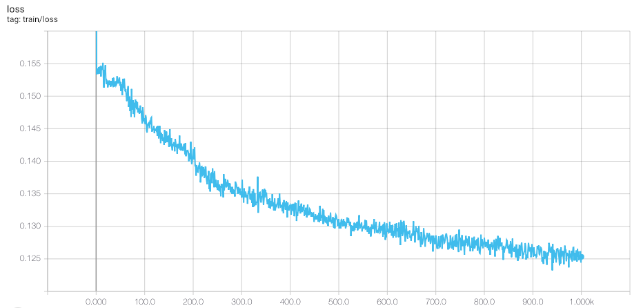
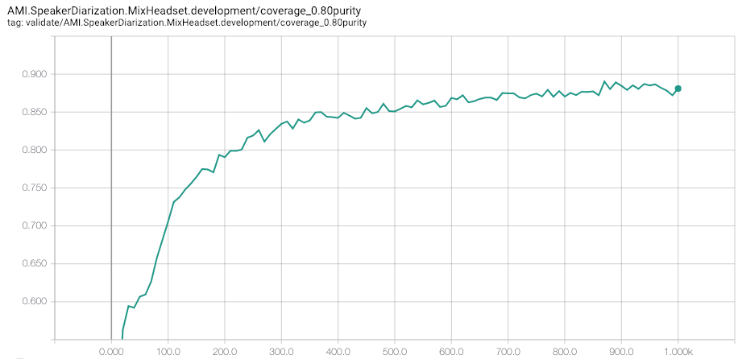

> The MIT License (MIT)
>
> Copyright (c) 2017-2019 CNRS
>
> Permission is hereby granted, free of charge, to any person obtaining a copy
> of this software and associated documentation files (the "Software"), to deal
> in the Software without restriction, including without limitation the rights
> to use, copy, modify, merge, publish, distribute, sublicense, and/or sell
> copies of the Software, and to permit persons to whom the Software is
> furnished to do so, subject to the following conditions:
>
> The above copyright notice and this permission notice shall be included in all
> copies or substantial portions of the Software.
>
> THE SOFTWARE IS PROVIDED "AS IS", WITHOUT WARRANTY OF ANY KIND, EXPRESS OR
> IMPLIED, INCLUDING BUT NOT LIMITED TO THE WARRANTIES OF MERCHANTABILITY,
> FITNESS FOR A PARTICULAR PURPOSE AND NONINFRINGEMENT. IN NO EVENT SHALL THE
> AUTHORS OR COPYRIGHT HOLDERS BE LIABLE FOR ANY CLAIM, DAMAGES OR OTHER
> LIABILITY, WHETHER IN AN ACTION OF CONTRACT, TORT OR OTHERWISE, ARISING FROM,
> OUT OF OR IN CONNECTION WITH THE SOFTWARE OR THE USE OR OTHER DEALINGS IN THE
> SOFTWARE.
>
> AUTHORS
> Ruiqing Yin
> Hervé Bredin - http://herve.niderb.fr

# Speaker change detection with `pyannote.audio`

In this tutorial, you will learn how to train, validate, and apply a speaker change detector based on MFCCs and LSTMs, using `pyannote-change-detection` command line tool.

## Table of contents
- [Citation](#citation)
- [Databases](#databases)
- [Configuration](#configuration)
- [Training](#training)
- [Validation](#validation)
- [Application](#application)
- [More options](#more-options)

## Citation
([↑up to table of contents](#table-of-contents))

If you use `pyannote-audio` for speaker change detection, please cite the following paper:

```bibtex
@inproceedings{Yin2017,
  Author = {Ruiqing Yin and Herv\'e Bredin and Claude Barras},
  Title = {{Speaker Change Detection in Broadcast TV using Bidirectional Long Short-Term Memory Networks}},
  Booktitle = {{Interspeech 2017, 18th Annual Conference of the International Speech Communication Association}},
  Year = {2017},
  Month = {August},
  Address = {Stockholm, Sweden},
  Url = {https://github.com/yinruiqing/change_detection}
}
```

## Databases
([↑up to table of contents](#table-of-contents))

```bash
$ source activate pyannote
$ pip install pyannote.db.odessa.ami
$ pip install pyannote.db.musan
```

This tutorial relies on the [AMI](http://groups.inf.ed.ac.uk/ami/corpus) and [MUSAN](http://www.openslr.org/17/) databases. We first need to tell `pyannote` where the audio files are located:

```bash
$ cat ~/.pyannote/db.yml | grep AMI
AMI: /path/to/ami/amicorpus/*/audio/{uri}.wav
$ cat ~/.pyannote/db.yml | grep MUSAN
MUSAN: /path/to/musan/{uri}.wav
```

If you want to use a different database, you might need to create your own [`pyannote.database`](http://github.com/pyannote/pyannote-database) plugin.
See [github.com/pyannote/pyannote-db-template](https://github.com/pyannote/pyannote-db-template) for details on how to do so. You might also use `pip search pyannote` to browse existing plugins.

## Configuration
([↑up to table of contents](#table-of-contents))

To ensure reproducibility, `pyannote-change-detection` relies on a configuration file defining the experimental setup:

```bash
$ cat tutorials/models/speakker_change_detection/config.yml
```
```yaml
task:
   name: SpeakerChangeDetection
   params:
      duration: 2.0      # sequences are 2s long
      collar: 0.100      # upsampling collar = 100ms
      non_speech: False  # do not try to detect non-speech/speaker changes
      batch_size: 64     # 64 sequences per batch
      per_epoch: 1       # one epoch = 1 day of audio

data_augmentation:
   name: AddNoise                                   # add noise on-the-fly
   params:
      snr_min: 10                                   # using random signal-to-noise
      snr_max: 20                                   # ratio between 10 and 20 dBs
      collection: MUSAN.Collection.BackgroundNoise  # use background noise from MUSAN
                                                    # (needs pyannote.db.musan)
feature_extraction:
   name: LibrosaMFCC      # use MFCC from librosa
   params:
      e: False            # do not use energy
      De: True            # use energy 1st derivative
      DDe: True           # use energy 2nd derivative
      coefs: 19           # use 19 MFCC coefficients
      D: True             # use coefficients 1st derivative
      DD: True            # use coefficients 2nd derivative
      duration: 0.025     # extract MFCC from 25ms windows
      step: 0.010         # extract MFCC every 10ms
      sample_rate: 16000  # convert to 16KHz first (if needed)

architecture:
   name: StackedRNN
   params:
      instance_normalize: True  # normalize sequences
      rnn: LSTM                 # use LSTM (could be GRU)
      recurrent: [128, 128]     # two layers with 128 hidden states
      bidirectional: True       # bidirectional LSTMs
      linear: [32, 32]          # add two linear layers at the end 

scheduler:
   name: CyclicScheduler        # use cyclic learning rate (LR) scheduler
   params:
      learning_rate: auto       # automatically guess LR upper bound
      epochs_per_cycle: 14      # 14 epochs per cycle
```

## Training
([↑up to table of contents](#table-of-contents))

The following command will train the network using the training set of AMI database for 1000 epochs:

```bash
$ export EXPERIMENT_DIR=tutorials/models/speaker_change_detection
$ pyannote-change-detection train --gpu --to=1000 ${EXPERIMENT_DIR} AMI.SpeakerDiarization.MixHeadset
```

This will create a bunch of files in `TRAIN_DIR` (defined below).
One can follow along the training process using [tensorboard](https://github.com/tensorflow/tensorboard).
```bash
$ tensorboard --logdir=${EXPERIMENT_DIR}
```




## Validation
([↑up to table of contents](#table-of-contents))

To get a quick idea of how the network is doing during training, one can use the `validate` mode.
It can (should!) be run in parallel to training and evaluates the model epoch after epoch.
One can use [tensorboard](https://github.com/tensorflow/tensorboard) to follow the validation process.

```bash
$ export TRAIN_DIR=${EXPERIMENT_DIR}/train/AMI.SpeakerDiarization.MixHeadset.train
$ pyannote-change-detection validate --purity=0.8 ${TRAIN_DIR} AMI.SpeakerDiarization.MixHeadset
```

In practice, it is tuning a simple speaker change detection pipeline (pyannote.audio.pipeline.speaker_change_detection.SpeakerChangeDetection) after each epoch and stores the best hyper-parameter configuration on disk:

```bash
$ cat ${TRAIN_DIR}/validate/AMI.SpeakerDiarization.MixHeadset/params.yml
```
```yaml
epoch: 870
params:
  alpha: 0.17578125
  min_duration: 0.0
```

One can also use [tensorboard](https://github.com/tensorflow/tensorboard) to follow the validation process.




## Application
([↑up to table of contents](#table-of-contents))

Now that we know how the model is doing, we can apply it on all files of the AMI database and store raw change scores in `/path/to/precomputed/scd`:

```bash
$ pyannote-change-detection apply ${TRAIN_DIR}/weights/0870.pt AMI.SpeakerDiarization.MixHeadset /path/to/precomputed/scd
```

We can then use these raw scores to perform actual speaker change detection, and [`pyannote.metrics`](http://pyannote.github.io/pyannote-metrics/) to evaluate the result:


```python
# AMI protocol
>>> from pyannote.database import get_protocol
>>> protocol = get_protocol('AMI.SpeakerDiarization.MixHeadset')

# precomputed scores
>>> from pyannote.audio.features import Precomputed
>>> precomputed = Precomputed('/path/to/precomputed/scd')

# peak detection
>>> from pyannote.audio.signal import Peak
# alpha / min_duration are tunable parameters (and should be tuned for better performance)
# we use log_scale = True because of the final log-softmax in the StackedRNN model
>>> peak = Peak(alpha=0.17, min_duration=0.0, log_scale=True)

# evaluation metric
>>> from pyannote.metrics.diarization import DiarizationPurityCoverageFMeasure
>>> metric = DiarizationPurityCoverageFMeasure()

# loop on test files
>>> from pyannote.database import get_annotated
>>> for test_file in protocol.test():
...    # load reference annotation
...    reference = test_file['annotation']
...    uem = get_annotated(test_file)
...
...    # load precomputed change scores as pyannote.core.SlidingWindowFeature
...    scd_scores = precomputed(test_file)
...
...    # binarize scores to obtain speech regions as pyannote.core.Timeline
...    hypothesis = peak.apply(scd_scores, dimension=1)
...
...    # evaluate speech activity detection
...    metric(reference, hypothesis.to_annotation(), uem=uem)

>>> purity, coverage, fmeasure = metric.compute_metrics()
>>> print(f'Purity = {100*purity:.1f}% / Coverage = {100*coverage:.1f}%')
```

## More options

For more options, see:

```bash
$ pyannote-change-detection --help
```

That's all folks!
