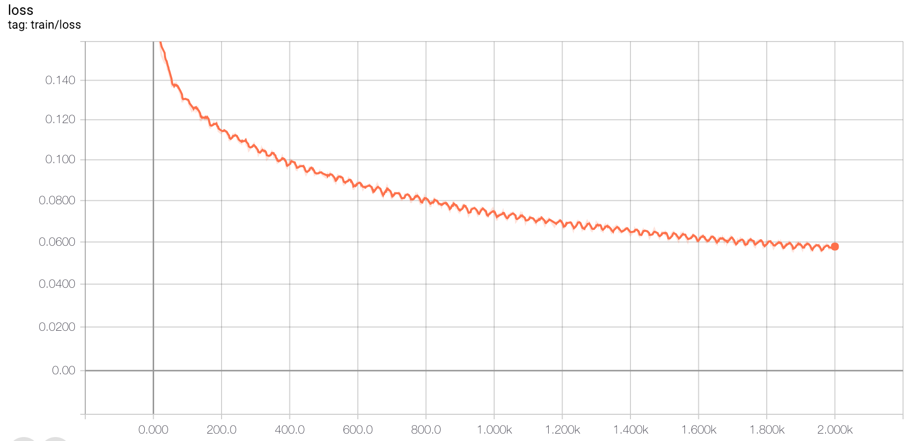

> The MIT License (MIT)
>
> Copyright (c) 2017-2019 CNRS
>
> Permission is hereby granted, free of charge, to any person obtaining a copy
> of this software and associated documentation files (the "Software"), to deal
> in the Software without restriction, including without limitation the rights
> to use, copy, modify, merge, publish, distribute, sublicense, and/or sell
> copies of the Software, and to permit persons to whom the Software is
> furnished to do so, subject to the following conditions:
>
> The above copyright notice and this permission notice shall be included in all
> copies or substantial portions of the Software.
>
> THE SOFTWARE IS PROVIDED "AS IS", WITHOUT WARRANTY OF ANY KIND, EXPRESS OR
> IMPLIED, INCLUDING BUT NOT LIMITED TO THE WARRANTIES OF MERCHANTABILITY,
> FITNESS FOR A PARTICULAR PURPOSE AND NONINFRINGEMENT. IN NO EVENT SHALL THE
> AUTHORS OR COPYRIGHT HOLDERS BE LIABLE FOR ANY CLAIM, DAMAGES OR OTHER
> LIABILITY, WHETHER IN AN ACTION OF CONTRACT, TORT OR OTHERWISE, ARISING FROM,
> OUT OF OR IN CONNECTION WITH THE SOFTWARE OR THE USE OR OTHER DEALINGS IN THE
> SOFTWARE.
>
> AUTHOR
> Hervé Bredin - http://herve.niderb.fr

# Neural speech turn embedding with `pyannote.audio`

In this tutorial, you will learn how to train a speech turn embedding using `pyannote-speaker-embedding` command line tool.

## Table of contents
- [Citation](#citation)
- [Databases](#databases)
- [Configuration](#configuration)
- [Training](#training)
- [Validation](#validation)
- [Application](#application)
- [More options](#more-options)

## Citation
([↑up to table of contents](#table-of-contents))

If you use `pyannote-audio` for speaker (or audio) neural embedding, please cite the following paper:

```bibtex
@inproceedings{Bredin2017,
    author = {Herv\'{e} Bredin},
    title = {{TristouNet: Triplet Loss for Speaker Turn Embedding}},
    booktitle = {42nd IEEE International Conference on Acoustics, Speech and Signal Processing, ICASSP 2017},
    year = {2017},
    url = {http://arxiv.org/abs/1609.04301},
}
```

## Databases
([↑up to table of contents](#table-of-contents))

```bash
$ source activate pyannote
$ pip install pyannote.db.odessa.ami
$ pip install pyannote.db.musan
$ pip install pyannote.db.voxceleb
```

This tutorial relies on the [VoxCeleb](http://www.robots.ox.ac.uk/~vgg/data/voxceleb/), [AMI](http://groups.inf.ed.ac.uk/ami/corpus) and [MUSAN](http://www.openslr.org/17/) databases. We first need to tell `pyannote` where the audio files are located:

```bash
$ cat ~/.pyannote/db.yml | grep VoxCeleb
VoxCeleb: /path/to/voxceleb1/*/wav/{uri}.wav
$ cat ~/.pyannote/db.yml | grep AMI
AMI: /path/to/ami/amicorpus/*/audio/{uri}.wav
$ cat ~/.pyannote/db.yml | grep MUSAN
MUSAN: /path/to/musan/{uri}.wav
```

If you want to use a different database, you might need to create your own [`pyannote.database`](http://github.com/pyannote/pyannote-database) plugin.
See [github.com/pyannote/pyannote-db-template](https://github.com/pyannote/pyannote-db-template) for details on how to do so. You might also use `pip search pyannote` to browse existing plugins.

## Configuration
([↑up to table of contents](#table-of-contents))

To ensure reproducibility, `pyannote-speaker-embedding` relies on a configuration file defining the experimental setup:

```bash
$ cat tutorials/models/speaker_embedding/config.yml
```
```yaml
feature_extraction:
   name: LibrosaMFCC
   params:
      e: False
      De: True
      DDe: True
      coefs: 19
      D: True
      DD: True
      duration: 0.025
      step: 0.010
      sample_rate: 16000

data_augmentation:
   name: AddNoise
   params:
     snr_min: 10
     snr_max: 20
     collection: MUSAN.Collection.BackgroundNoise

architecture:
   name: ClopiNet
   params:
     instance_normalize: True
     rnn: LSTM
     recurrent: [256, 256, 256]
     linear: [256]
     bidirectional: True
     pooling: sum
     batch_normalize: True
     normalize: True
     
approach:
   name: TripletLoss
   params:
     metric: cosine
     clamp: sigmoid
     margin: 0.0
     min_duration: 0.500
     max_duration: 1.500
     sampling: all
     per_fold: 20
     per_label: 3
     per_epoch: 1
     label_min_duration: 60

scheduler:
   name: CyclicScheduler
   params:
      epochs_per_cycle: 14
```

## Training
([↑up to table of contents](#table-of-contents))

The following command will train the network using VoxCeleb1 for 1000 epochs (one epoch = one day of audio)

```bash
$ export EXPERIMENT_DIR=tutorials/models/speaker_embedding
$ pyannote-speaker-embedding train --gpu --to=1000 ${EXPERIMENT_DIR} VoxCeleb.SpeakerVerification.VoxCeleb1
```

This will create a bunch of files in `TRAIN_DIR` (defined below).
One can follow along the training process using [tensorboard](https://github.com/tensorflow/tensorboard).
```bash
$ tensorboard --logdir=${EXPERIMENT_DIR}
```




## Validation
([↑up to table of contents](#table-of-contents))

To get a quick idea of how the network is doing during training, one can use the `validate` mode.
It can (should!) be run in parallel to training and evaluates the model epoch after epoch.
One can use [tensorboard](https://github.com/tensorflow/tensorboard) to follow the validation process.

```bash
$ export TRAIN_DIR=${EXPERIMENT_DIR}/train/VoxCeleb.SpeakerVerification.VoxCeleb1.train
$ pyannote-speaker-embedding validate --subset=test ${TRAIN_DIR} VoxCeleb.SpeakerDiarization.VoxCeleb1
```


This model reaches approximately 7% EER on VoxCeleb1.

## Application
([↑up to table of contents](#table-of-contents))

Now that we know how the model is doing, we can apply it on all files of the AMI database store embeddings in `/path/to/precomputed/emb`:

```bash
$ pyannote-speaker-embedding apply ${TRAIN_DIR}/weights/2000.pt AMI.SpeakerDiarization.MixHeadset /path/to/precomputed/emb
```

We can then use these extracted embeddings like this:


```python
# first test file of AMI protocol
>>> from pyannote.database import get_protocol
>>> protocol = get_protocol('AMI.SpeakerDiarization.MixHeadset')
>>> test_file = next(protocol.test())

# precomputed embeddings as pyannote.core.SlidingWindowFeature
>>> from pyannote.audio.features import Precomputed
>>> precomputed = Precomputed('/path/to/precomputed/emb')
>>> embeddings = precomputed(test_file)

# iterate over all embeddings
>>> for window, embedding in embeddings:
...     print(window)
...     print(embedding)
...     break

# extract embedding from a specific segment
>>> from pyannote.core import Segment
>>> fX = embeddings.crop(Segment(10, 20))
>>> print(fX.shape)
```

## More options

For more options, see:

```bash
$ pyannote-speaker-embedding --help
```

That's all folks!
